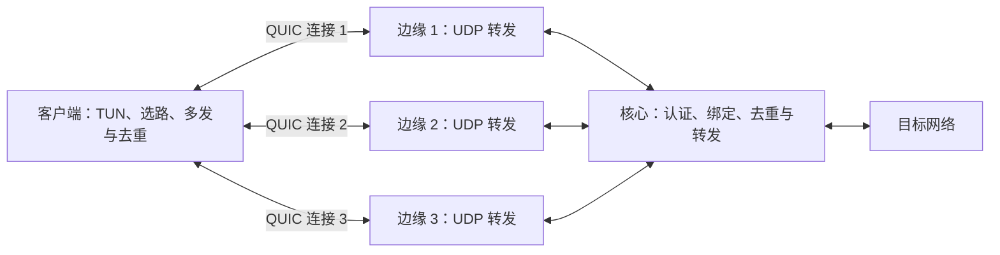

# quicwire

使用 **Rust + Quinn** 开发的独立多路径 QUIC 冗余 IP 隧道。

两端像 WireGuard 一样预先配置对端公钥。客户端通过多个边缘接入点连接核心服务器；同一个 IP 包在多条独立 QUIC 连接上发送，接收端只交付最先收到的有效副本。

> 当前处于需求与设计阶段。用户要求先完成全部设计，再进入开发：需求边界、协议、异常行为、配置与验收标准经评审确认后，才开始实现。现有代码仅为工程骨架。

## 设计方向

- **公私钥身份**：私钥本地保存，通过预配置的 peer 公钥授权，无账号系统、认证 API 或外部签发凭证。
- **双向冗余**：上行和下行都支持 K 份副本，按 session 和方向去重。
- **独立路径**：每条路径使用独立 QUIC 连接，在应用层绑定为一个逻辑 session。
- **路径隔离**：独立有界发送队列；拥塞路径不阻塞其他路径。
- **动态选路**：控制链交换测量结果、路径集合及多发份数。
- **可调整拥塞控制**：使用 Quinn 的公开接口；通过真实线路测试选择算法。

quicwire 借鉴 WireGuard 的 peer 配置方式，传输协议使用 QUIC；不承诺 WireGuard 协议或密钥格式兼容。



## 本地构建

安装 Rust 工具链后，在仓库根目录运行：

```sh
cargo build --locked
cargo run --locked -- --help
cargo run --locked -- --version
```

工具链由 `rust-toolchain.toml` 固定，依赖版本由 `Cargo.lock` 固定。当前命令只展示帮助与版本，不启动网络服务。

## 开发检查

```sh
cargo fmt --all -- --check
cargo clippy --locked --all-targets -- -D warnings
cargo test --locked --all-targets
```

当前尚无功能测试；实现协议与数据面时同步增加相应测试。

## 文档

- [需求与验收边界](docs/requirements.md)
- [Rust + Quinn 选型记录](docs/architecture.md)
- [设计决策与评审清单](docs/design-review.md)
- [验收场景草案](docs/acceptance.md)
- [设计与实施顺序](docs/roadmap.md)

## 许可

项目许可证待确定，当前仓库未授予开源许可证。
