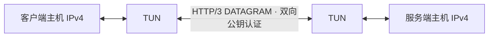

# quicwire

基于 **Rust + Quinn** 的独立 QUIC IP 隧道，使用本地公私钥和预配置 peer 公钥，不依赖认证 API、账号或数据库。

当前已实现基础版：Linux 两台主机之间的多连接 HTTP/3 + QUIC DATAGRAM + IPv4 TUN，包含双向公钥认证、同包多发与去重、质量选路、备用五元组轮转、本地状态监控和 systemd 示例。所有入口归属于同一服务端实例，当前仍为单 peer。



## 快速开始

```sh
cargo build --release --locked
target/release/quicwire --help
target/release/quicwire keygen --out local.key
```

两端分别生成密钥，交换并配置对端公钥。服务端和客户端配置参考 [examples/server.toml](examples/server.toml) 与 [examples/client.toml](examples/client.toml)，替换公钥及服务器地址后运行：

```sh
quicwire check --config quicwire.toml
sudo quicwire run --config quicwire.toml
```

完整配置、systemd 安装、协议格式、故障行为与验证命令见 [基础隧道文档](docs/basic-tunnel.md)，验证结果见 [PVE 双机实测记录](docs/testing.md) 和 [WireGuard 对比](docs/wireguard-comparison.md)。TUN 数据面目前只支持 Linux；macOS 可使用密钥工具及配置检查。

基础版只传输两端主机的隧道地址流量，内层 MTU 默认 1100；不配置默认路由、NAT 或第三方子网转发。公钥配置方式借鉴 WireGuard，使用 Ed25519 + TLS 1.3 公钥固定验证（X.509 容器），协议与密钥格式均独立。

当前版本 0.3.3：ALPN 为 `h3`，使用真实 HTTP/3 Extended CONNECT 与 HTTP Datagrams，私有 `:protocol=quicwire` 帧提供跨连接序号、探测和激活集合控制。原有公私钥与单连接配置仍可使用，但两端程序必须同时升级，不能与 0.2.x 混用。可选 `server_name` 配置 SNI。详见 [多路径配置与监控](docs/multipath.md) 和 [HTTP/3 协议与外观边界](docs/http3.md)。

客户端 `endpoints` 支持多个 IP/端口范围；`max_sessions=8` 维持 8 条连接，`active_sessions=2` 双向发送两份副本并去重，其余连接持续探测。`standby_rotate_secs=180` 使连续备用三分钟的连接更换 UDP 源端口重新采样。服务端 `listen=["0.0.0.0:4433-4440"]` 提供多个入口。`endpoints` 可使用 `{ address="192.0.2.1:4433-4440", exclusive_group="direct" }` 对象，同组最多一条激活；直连/中转分组后严格跨组双发，整组故障时降为单副本。`status` 显示全局和各路径的有效接收包、重复副本；默认简洁排版，`--verbose` 展开详情，`--json` 输出完整数据。`selection_policy` 提供 `balanced`、`low_latency`、`low_loss`、`hybrid` 四种预设，混合模式使用低丢包保障路径加低延迟副本。启动按配置顺序激活前 K 条，`switch_threshold_percent` 配置评分切换门槛。`stable_session_ttl_secs=300` 与 `ttl_max_degradation_percent=10` 使稳定会话到期后允许评分最多差 10% 的健康备用接替；即使当前会话最好也轮换，备用差太多或缺失则延期。`reserve_sessions=1` 保留最佳备用，接替经服务端确认后才关闭旧会话。

```sh
sudo quicwire status --config /etc/quicwire/quicwire.toml
sudo quicwire status --config /etc/quicwire/quicwire.toml --json
```

## 开发检查

```sh
cargo fmt --all -- --check
cargo clippy --locked --all-targets -- -D warnings
cargo test --locked --all-targets
cargo build --locked
sudo bash scripts/linux-smoke.sh target/debug/quicwire
```

Rust 版本和依赖分别由 `rust-toolchain.toml`、`Cargo.lock` 固定。CI 在 Linux 执行以上检查并生成 release 构建。

## 后续设计

用户于 2026-10-02 调整顺序，先交付基础 QUIC + TUN 隧道并做双机测试。以下文档保留更完整平台目标和未决事项，已实现边界以多路径配置文档为准：

- [需求与验收边界](docs/requirements.md)
- [Rust + Quinn 选型记录](docs/architecture.md)
- [设计决策与评审清单](docs/design-review.md)
- [多路径验收场景草案](docs/acceptance.md)
- [设计与实施顺序](docs/roadmap.md)

## 许可

项目许可证待确定，当前仓库未授予开源许可证。

## 可选 FEC

`fec = 0`（默认）保留同包多发；`fec = 1/2/3` 切换为原始包单发，并为每组发送对应份数的 XOR 校验包。两端配置必须一致。配置示例、带宽口径与恢复限制见 [FEC 前向纠错](docs/fec.md)。
