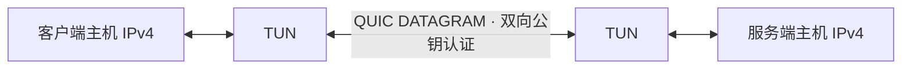

# quicwire

基于 **Rust + Quinn** 的独立 QUIC IP 隧道，使用本地公私钥和预配置 peer 公钥，不依赖认证 API、账号或数据库。

当前已实现基础版：Linux 两台主机之间的单路径 QUIC DATAGRAM + IPv4 TUN，包含双向公钥认证、配置校验、自动重连、源地址约束和 systemd 示例。多路径复制、去重和动态选路仍在设计中。



## 快速开始

```sh
cargo build --release --locked
target/release/quicwire --help
target/release/quicwire keygen --out local.key
```

两端分别生成密钥，交换并配置对端公钥。服务端和客户端配置参考 [examples/server.toml](examples/server.toml) 与 [examples/client.toml](examples/client.toml)，替换公钥及服务器地址后运行：

```sh
quicwire check --config quicwire.toml
sudo quicwire run --config quicwire.toml
```

完整配置、systemd 安装、协议格式、故障行为与验证命令见 [基础隧道文档](docs/basic-tunnel.md)，验证结果见 [PVE 双机实测记录](docs/testing.md) 和 [WireGuard 对比](docs/wireguard-comparison.md)。TUN 数据面目前只支持 Linux；macOS 可使用密钥工具及配置检查。

基础版只传输两端主机的隧道地址流量，内层 MTU 默认 1100；不配置默认路由、NAT 或第三方子网转发。公钥配置方式借鉴 WireGuard，使用 Ed25519 + TLS 1.3 Raw Public Key，协议与密钥格式均独立。

## 开发检查

```sh
cargo fmt --all -- --check
cargo clippy --locked --all-targets -- -D warnings
cargo test --locked --all-targets
cargo build --locked
sudo bash scripts/linux-smoke.sh target/debug/quicwire
```

Rust 版本和依赖分别由 `rust-toolchain.toml`、`Cargo.lock` 固定。CI 在 Linux 执行以上检查并生成 release 构建。

## 后续设计

用户于 2026-10-02 调整顺序，先交付基础 QUIC + TUN 隧道并做双机测试。以下文档保留多路径目标和未决事项，不能据此认为完整多路径能力已经实现：

- [需求与验收边界](docs/requirements.md)
- [Rust + Quinn 选型记录](docs/architecture.md)
- [设计决策与评审清单](docs/design-review.md)
- [多路径验收场景草案](docs/acceptance.md)
- [设计与实施顺序](docs/roadmap.md)

## 许可

项目许可证待确定，当前仓库未授予开源许可证。
